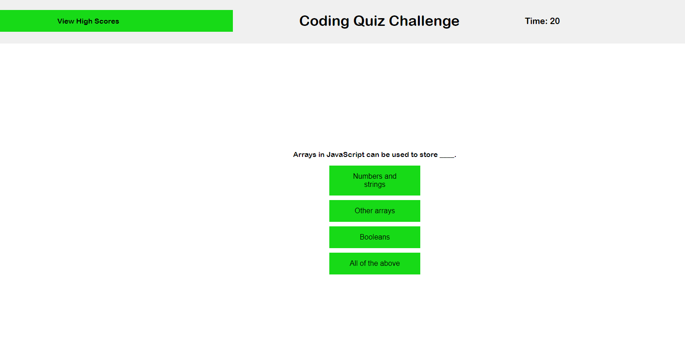

# CodeQuiz-Challenge4-Web-APIs

<h2>Project Description - For bootcamp challenge 4:<h2> 

<h3>To sufficiently demonstrate advanced JavaScript skills learnt from week 4 and how cohesively they can be implented and paired into/with the HTML skills and CSS. This was done by creating a test on basic JavaScript concepts and knowledge under certain conditions such as having a timer, time deductions for getting questions wrong and more. <h3>

<h2>No installation is required.<h2>

<h2>Additional Credits - N/A

<h2>How to use:<h2>

<h3>The project is based around launching a static webpage with a functional test incorporating features like a high score recorder.<h3>

<h2>License - MIT License<h2>
<h3>Refer to license to see permissions<h3>

<h2>Website link: https://bemonn.github.io/CodeQuiz-Challenge4-WebAPIs/  
<h2>

<h2> JavaScript test in progress <h2>

